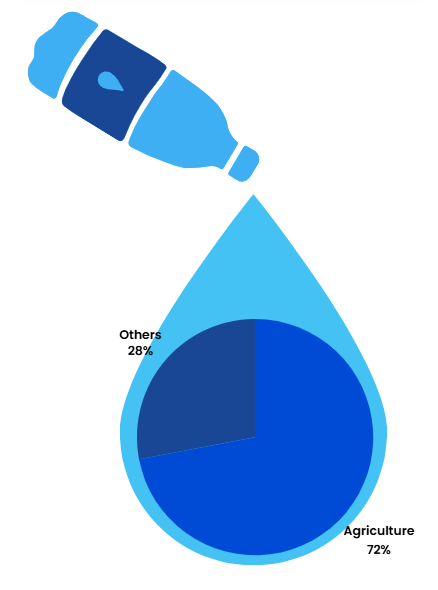

# Fall 2024 Data Vis CS 6730 Team Project

Team members: Elliott Chen, Hyunju Ji, Sean Liu, Seohee Yoon

Topic: Environmental Impacts of Agriculture

# Overview

As the global population continues to grow, the demand for food increases, creating environmental challenges. Many agricultural practices contribute to environmental degradation. For example, cattle farming and the use of agricultural chemicals release greenhouse gases such as methane and nitrous oxide. These greenhouse gases trap heat in the atmosphere, worsening air pollution. Overgrazing weakens soil quality and reduces biodiversity, leaving ecosystems vulnerable to disruptions. Additionally, runoff from fertilizers and pesticides contaminates water sources, jeopardizing human and animal health. To better understand how agriculture has impacted the environment, we'll visualize greenhouse gas emissions, biodiversity changes, and water quality trends.

# Current Status of Agriculture

A few countries are clearly dominant in terms of agricultural land use, such as China, United States, and Australia. Within a continent, a couple of countries are the main agricultural producers- for example Brazil and Argentina in South America. This is no surprise given their land areas and in some cases, their populations. 

<iframe src="https://public.tableau.com/views/6730_Visualizations/AgriLandUse?:showVizHome=no&:embed=true" 
        width="800" 
        height="500" 
        frameborder="0"></iframe>
  
But what about agricultural energy consumption? Surely modern farming technology requires energy, whether in the form of electricity or fossil fuels. Here is how worldwide agricultural energy use has changed from 2012 to 2021.

<iframe src="https://public.tableau.com/views/6730_Visualizations/EnergyUseMap?:showVizHome=no&:embed=true" 
        width="800" 
        height="600" 
        frameborder="0"></iframe>
  
Pesticide use has displayed some interesting trends over the years. Click on a continent to focus on trends within that coontinent.

<iframe src="https://public.tableau.com/views/6730_Visualizations/PesticideUse?:showVizHome=no&:embed=true"
        width="800" 
        height="600" 
        frameborder="0"></iframe>
  
Another important aspect of agriculture is meat production. Here you can see changes in the primary types of meat production (beef, pork, poultry, lamb) over the years, and the countries that are primarily producing those meats.

<iframe src="https://public.tableau.com/views/meatproduction_stackedhorizontally_country/Sheet2?:showVizHome=no&:embed=true" 
        width="1200" 
        height="1040" 
        frameborder="0"></iframe>
  
Additionally, these are the leading producers for each of those meat types.

<iframe src="https://public.tableau.com/views/meatproduction_stackedhorizontally_country/Dashboard1?:showVizHome=no&:embed=true" 
        width="1200" 
        height="1040" 
        frameborder="0"></iframe>
  
# Greenhouse Gas Emissions

With this in mind, let's first look at greenhouse gas emissions. Greenhouse gases come from sources such as rice production, livestock farming (especially cows), fertilizer production, and fossil fuel consumption. The most common greenhouse gases are carbon dioxide (CO₂), methane (CH₄), and nitrous oxide (N₂O). There is the well-known greenhouse effect, where such greenhouse gases trap heat on the Earth, contributing to rising global temperatures and more extreme weather. It is estimated that around one-quarter of the world's greenhouse gas emissions come from agriculture.

<iframe src="https://public.tableau.com/views/gas_emssion/Sheet4?:showVizHome=no&:embed=true" 
        width="1200" 
        height="1040" 
        frameborder="0"></iframe>
  
As far as food production goes, livestock production is a leading cause of greenhouse gas emissions. The amount of greenhouse gas emissions varies greatly from country to country, and even within the same geographic region.

ADD ELLIOTT'S GAS EMISSIONS AND MEAT PRODUCTION VIZ

# Biodiversity

And now how is biodiversity affected?

Biodiversity is crucial for maintaining the natural processes that sustain life on Earth. Balanced ecosystems are essential for pollination, fresh air and water, healthy soil, and even medicines for illnesses. However, agricultural activities such as overgrazing, deforestation, and monoculture farming jeopardize biodiversity. When biodiversity declines, genetic diversity decreases, leaving ecosystems less resilient to environmental shocks such as disease or drought. Infectious diseases harmful to humans, animals, and plants are also more likely to spread. 

From an agricultural perspective, biodiversity plays a key role in soil fertility, nutrient cycling, and natural pest control, which are vital for sustainable farming practices. Without healthy ecosystems, agriculture becomes more dependent on chemical inputs, further exacerbating environmental damage.

Here are biodiversity rankings for various countries in the past two decades. Click on a country to see how its biodiversity ranking has changed over the years.

<iframe src="https://public.tableau.com/views/BumpChart_17322889494520/Sheet3?:showVizHome=no&:embed=true" 
        width="1100" 
        height="900" 
        frameborder="0"></iframe>
  
There are ways to preserve biodiversity through practices such as crop rotation, polyculture farming (i.e. growing multiple types of crops), no-till farming (which decreases erosion and retains soil moisture), agroforestry (i.e. planting trees on farmland), and supporting pollinators (e.g. birds, bees, butterflies). These approaches not only protect biodiversity but also boost agricultural productivity and sustainability in the long run.

# Water Quality

What about water quality? Water is undeniably vital to all life on Earth, both for agriculture and for all organisms.

Here you can see how worldwide water use has changed over the years.
<iframe src="https://public.tableau.com/views/water_use2/Sheet1?:showVizHome=no&:embed=true" 
        width="1400" 
        height="600" 
        frameborder="0"></iframe>
  
Water quality is an important variable.
ADD HYUNJU'S WATER QUALITY VIZ

# Conclusion

But at the end of day, are the environmental losses justifiable? What have we gained? Here you can see how total factor productivity (TFP), the ratio of aggregate outputs to aggregate inputs, has changed over the last 6 decades for regions around the world. Asia, South Europe, and South America (particularly Brazil) have made the largest improvements.

<iframe src="https://public.tableau.com/views/6730_Visualizations/TFPRegion?:showVizHome=no&:embed=true"
        width="800" 
        height="600" 
        frameborder="0"></iframe>

# Sources

https://ourworldindata.org/food-ghg-emissions 

https://www.epa.gov/enviroatlas/enviroatlas-benefit-category-biodiversity-conservation

https://www.icl-group.com/blog/the-importance-of-biodiversity-to-sustainability-and-the-future-of-agriculture/
